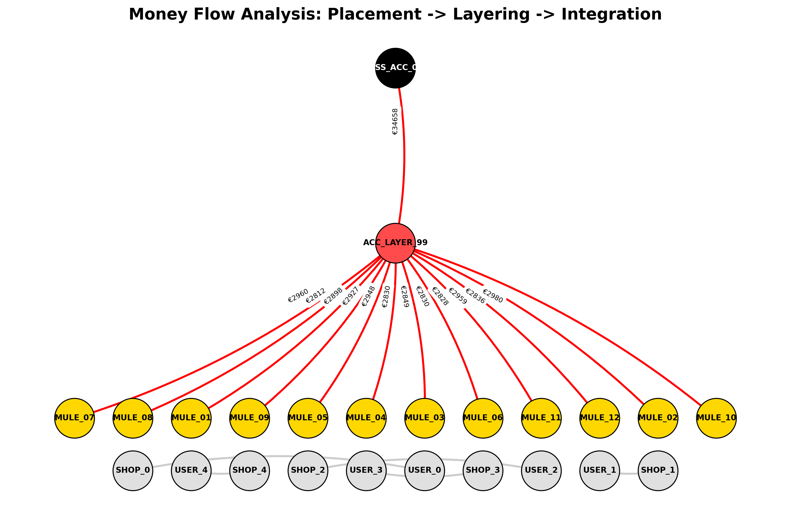

# Forensic Investigation: Money Laundering Detection 🕵️‍♂️

This project demonstrates an **Anti-Money Laundering (AML)** investigation framework. It leverages **Graph Theory (NetworkX)** and **SQL** to detect hidden "Smurfing" and "Structuring" patterns that traditional tabular analysis often misses.

### 🔍 The Scenario: "The Smurfing Ring"

A sophisticated money laundering scheme was suspected involving:

1.  **Placement:** Multiple "money mules" depositing small amounts (structuring) just below the $3,000 reporting threshold.
2.  **Layering:** Funds being funneled into a single intermediate account to obscure their origin.
3.  **Integration:** The aggregated total moving to a final beneficiary ("The Boss").

### 🛠 Technical Methodology

- **Data Source:** SQLite Database (`financial_records.db`) populated with simulated transaction logs.
- **Analysis Logic:**
  - Querying the database using **SQL**.
  - Mapping entities as **Nodes** and transactions as **Directed Edges**.
  - Using **Graph Algorithms** to detect high "In-Degree Centrality" (Hubs).
- **Visualization:** Hierarchical Flow Layout using `Matplotlib` and `NetworkX`.

### 📊 Forensic Evidence Analysis

The script generated the following evidence graph, visualizing the flow of illicit funds:



#### How to read this Graph:

- **Bottom Row (Grey Nodes):** Normal noise. These represent legitimate users (`USER_X`) making small purchases at shops (`SHOP_X`). Notice the unconnected, organic structure.
- **The "Gold" Layer (Mules):** A coordinated group of 12 accounts (`MULE_01` to `MULE_12`) initiating the scheme.
  - _Red Flag:_ All transfers are curiously close to the **€3,000 limit** (e.g., €2,980, €2,830).
- **The "Red" Hub (Layering):** Account `ACC_LAYER_99`.
  - _Red Flag:_ Extremely high **Fan-In** (12 incoming connections) but only 1 outgoing connection. It acts as a funnel.
- **The "Black" Target (The Boss):** Account `BOSS_ACC_001`.
  - _Red Flag:_ Receives the aggregated total (**€34,658**) in a single lump sum, completing the laundering cycle.

### 🚀 How to Run this Investigation

1.  **Install Requirements:**

    ```
    pip install pandas networkx matplotlib
    ```

2.  **Initialize Database (Mock Data):**
    This script creates the SQLite database and populates it with the suspicious patterns.

    ```
    python src/setup_database.py
    ```

3.  **Run Analysis & Generate Graph:**
    The forensic engine queries the DB and builds the visualization.
    ```
    python src/graph_analysis.py
    ```
    _Output image saved to: `evidence_flow.png`_

---

_Developed as part of the Fraud Prevention Portfolio by Santiago Torterolo._
